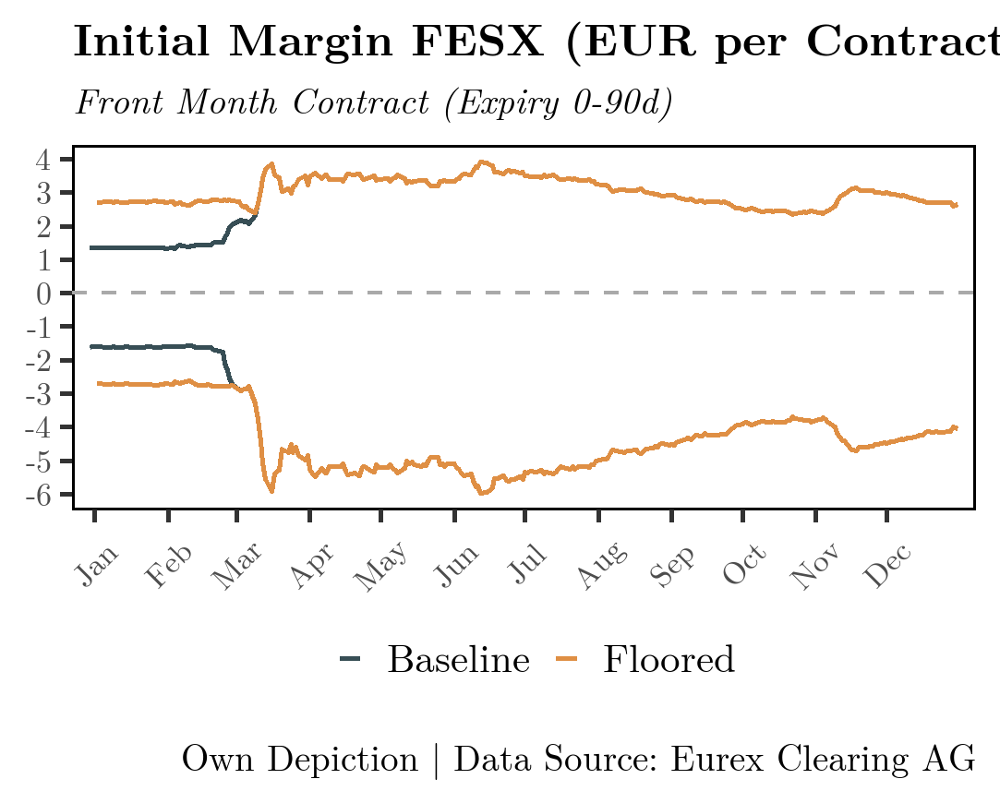
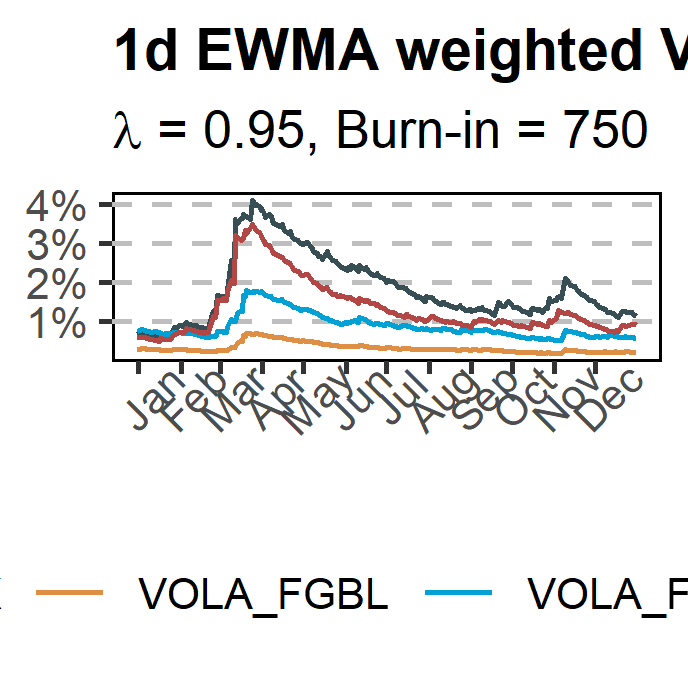

# MARGIN CALCULATIONS

---

This repository hosts all raw-data and code used to produce the models, graphs and calculations in my Bachelor Thesis **Margin Procyclicality during Covid 19 - Drivers, 
Impact and Solutions**

---


### :open_file_folder: Description of Files

- All functions needed to calculate Margins are contained in the file :link: 
- The files for each plot are located in the :link:  folder
- All plots as .png files are located in  :link: *
- All procyclicality measures as reported in XXX are located in the file :link: 
- All other source data used can be found in :link: 

### :bar_chart: Margin Calculation

:one: All necessary arguments / static parameters which are needed as inputs for the Margin model must be stored in a list.

Necessary arguments:

- MPOR - Marign Period of Risk
- Factor - Robust upscaling Factor
- quantile - VaR quantile
- lambda - decay factor for the EWMA volatility calculation
- n_day - length of lookback period
- liq_group - liquidation group of the instrument for which margin is - calculated
- short - whether the margin is calculated for a long or short position

:two: the Margin Calculation functions refer to a file called *master* which is located in :link: . This file
contains the product names, their risk factors and other information such as stress dates for the floored margin calculation.

Further products can be added to this file if you wish to calculate margin reuqirement for other futures.

This file must first be loaded into memory and be stored as *master* with the function *read_master()*

```
# read and store master file
master <- read_master("Data/data_input.xlsx")

# store parameters 
params <- list(
    MPOR = 3, factor = 2, quantile = .95, 
    lambda = .95, n_day = 750, liq_group = "PEQ01", 
    short = FALSE
)
```

:three: Calculate Margin
```
# calculate filtered historical margin (unfloored) for FESX

out <- calculate_fhs_margin(product = "FESX", start = start_date, 
end = end_date, args = params)

# calculate floored margin (productive)
out <- calculate_margin(product = "FESX", start = start_date, 
end = end_date, args = params)

# calculate margin floor (stress period margin)
out <- calculate_sp_margin(product = "FESX", start = start_date, 
end = end_date, args = params)

# calculate procyclicality measures 
must include steps = TRUE!
```

### :rocket: Output Examples

|   |   | |
:-------------------------:|:-------------------------:|:-------------------------:
  |   |   
